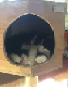

</img>

# An easy way to import images into Geometry Dash while preserving quality.
 ---
  
  

## Instalation:

 1. If you do not have Node.js, make sure to download it (<a href="https://nodejs.org">here</a>)   You can check to see if it properly installed by runing `node --version` in a command prompt

 1. Download and unzip this repository or clone it to your computer

 1. Open a command prompt and run `node 'fullPathToProgram' /main.js` to start the program.

 1. Follow the prompts to load the image into your geometry dash level.
 
---

## GDImageLoader:

Most other Geometry Dash image loaders use standard rendering, loading each pixel as a different object. This can cause massive lag with images that have high resolutions.

This program optimizes the amount of objects used, as well as the quality of the image through raster vectorization. 
 
It will try to turn groups of pixels into primitive objects, such as triangles, circles, and squares. This will ultimatly lead to a much lower object count, while still maintaining quality.

<table>
    <tr>
        <td align="center" width="50%">Standard render</td>
        <td align="center" width="50%">Vector render<td>
    </tr>
    <tr align="center">
        <td>
        
        </td>
        <td >
        
        </td>
    </tr>
</table>
The results you get may vary based on your configuration. It may take some time tuning the values to maximize the efectiveness of this render system.
